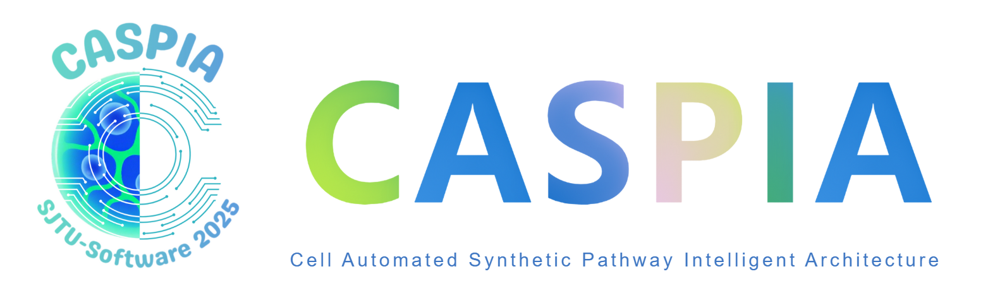
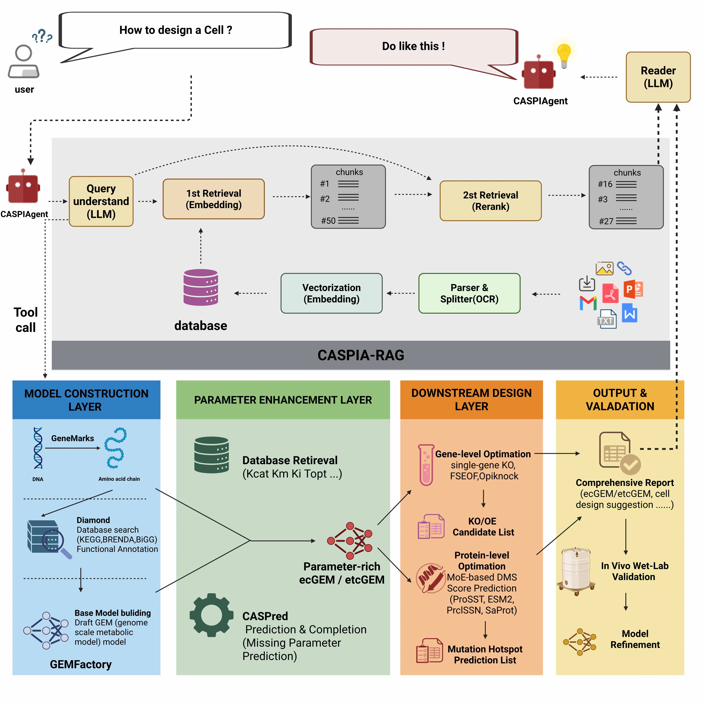

# CASPIA: Cell Automated Synthetic Pathway Intelligent Architecture

<p align="center">
  
</p>

<p align="center">
  <a href="LICENSE"></a>
  <a href="https://www.python.org/downloads/"></a>
  <a href="https://2025.igem.org/"></a>
  <a href="https://2025.igem.wiki/sjtu-software/"></a>
</p>


> **Team SJTU-Software 2025 Official Software Tool**
> 
> This repository contains the complete source code for CASPIA, an AI-powered platform designed to revolutionize synthetic biology research through intelligent automation, knowledge retrieval, and metabolic modeling.

**Team Wiki**: [Visit our iGEM Wiki](https://2025.igem.wiki/sjtu-software/)

---

## Table of Contents

- [Overview](#overview)
- [Key Features](#key-features)
- [Architecture](#architecture)
- [Installation](#installation)
  - [Requirements](#requirements)
  - [Setup Instructions](#setup-instructions)
- [Usage](#usage)
  - [Quick Start](#quick-start)
  - [Module-Specific Usage](#module-specific-usage)
- [Modules Description](#modules-description)
  - [CASPIAgent](#caspiagent)
  - [GEMFactory](#gemfactory)
  - [CASPIA-RAG](#caspia-rag)
  - [Tasks Monitor](#tasks-monitor)
- [Examples](#examples)
- [Project Structure](#project-structure)
- [Contributing](#contributing)
- [Testing](#testing)
- [Citation](#citation)
- [Authors and Acknowledgments](#authors-and-acknowledgments)
- [License](#license)
- [Contact](#contact)

---

## Overview

**CASPIA (Cell-Automated Synthetic Pathway Intelligent Architecture)** is an integrated AI-native software platform developed by Team **SJTU-Software** for the iGEM 2025 competition. The platform establishes a computational foundation for **digital cell twins**, unifying automated genome-scale modeling, high-precision parameter prediction, intelligent agent orchestration, and vision-enhanced literature retrieval.  

CASPIA enables researchers to move beyond fragmented trial-and-error workflows by providing:  

- **GEMFactory**: An automated pipeline that transforms raw genomes into parameter-enriched genome-scale metabolic models (ecGEMs / etcGEMs), incorporating kinetic and thermodynamic parameters such as *kcat* and *Topt*.  
- **CASPred**: A multimodal predictive engine that integrates protein sequence and structure representations to complete missing kinetic parameters with quantified uncertainty.  
- **CASPIAgent**: A natural-language-driven AI agent that plans and executes complex toolchains for gene annotation, model construction, parameter completion, and strain design optimization.  
- **CASPIA-RAG**: A vision-augmented Retrieval-Augmented Generation system capable of analyzing both text and figures from scientific literature to provide accurate, evidence-grounded answers.  

### Why CASPIA?  

Conventional synthetic biology workflows face major limitations:  
- Fragmented toolchains with inconsistent interfaces  
- Manual, error-prone curation of missing kinetic parameters  
- Difficulty in integrating knowledge hidden in figures, tables, and large literature corpora  
- High technical barriers for non-expert users  

CASPIA addresses these challenges by delivering a unified and intelligent framework that:  
- ✅ Automates genome-to-model pipelines with standardized interfaces  
- ✅ Completes missing parameters using cutting-edge predictive models  
- ✅ Provides intuitive natural language interaction through an AI agent  
- ✅ Preserves and interprets visual data from scientific publications  
- ✅ Supports reproducible, traceable, and scalable metabolic engineering workflows  

By compressing the **Design–Build–Test–Learn (DBTL)** cycle into an end-to-end digital workflow, CASPIA empowers researchers to achieve predictive, high-precision strain design and accelerates the realization of digital cell twins in synthetic biology.  

---

## Key Features

### 🤖 **CASPIAgent**
- Natural language interface for complex synthetic biology tasks  
- Automated orchestration of toolchains for gene annotation, GEM construction, parameter completion, and strain design  
- Task planning → execution → verification workflow with exception rollback  
- Context-aware reporting with full traceability of inputs, outputs, and data sources  

### 🧬 **GEMFactory**
- End-to-end automated pipeline: **raw genome → parameterized GEM (ecGEM / etcGEM)**  
- Integration of gene annotation (GeneMarkS), protein alignment (Diamond), and metabolic network reconstruction (CarveMe)  
- Automated parameter injection through database retrieval (BRENDA, KEGG, BiGG) and CASPred predictions  
- Multi-scale optimization:  
  - Gene-level strategies (FBA, FSEOF, OptKnock)  
  - Protein-level mutation design (Deep Mutational Scanning with MoE PLMs: ProSST, ESM2, ProtSSN, SaProt)  
- Standardized outputs in SBML and traceable reports for reproducibility  

### 🔬 **CASPred**
- High-precision predictive engine for missing kinetic and thermodynamic parameters (*kcat*, *Topt*)  
- Multimodal architecture combining **protein sequence embeddings (ESMC-300M)** and **structural features (GVP)**  
- Cross-attention fusion of sequence and structure for accurate enzyme–substrate interaction modeling  
- Ensemble learning with uncertainty quantification, providing both predicted values and confidence intervals  
- Continuously improved by incorporating new wet-lab data into training sets  

### 🔍 **CASPIA-RAG**
- **Vision-enhanced Retrieval-Augmented Generation** for scientific literature  
- PDF → Markdown structured parsing with figure/table extraction  
- Image-to-text semantic captioning using vision models  
- Context-preserving segmentation and embedding into Chroma vector database  
- Expert Mode with cross-attention re-ranking for precise, evidence-grounded retrieval  
- Accurate, cited answers integrating both textual and visual evidence  

### 📊 **Tasks Monitor**
- Real-time monitoring of CASPIA computational workflows  
- Visualization of job progress, status, and error recovery  
- Centralized log collection for reproducibility and debugging  
- Result aggregation and export for downstream analysis  

---

## Architecture



---

## Installation

### Requirements

**System Requirements:**
- Operating System: Linux (Ubuntu 20.04+), macOS (10.15+), or WSL2 on Windows
- Storage: 20GB+ free space
- RAM: 16GB minimum (32GB recommended)
- GPU: CUDA-compatible GPU with 16GB VRAM minimum (NVIDIA 4090 recommended)

**Software Dependencies:**
- Python: 3.10
- CUDA Toolkit 12.x (12.8 recommended)

### Setup Instructions

1. **Clone the Repository**

```bash
git clone https://github.com/shenmaa233/SJTU-software-CASPIA.git
cd SJTU-software-CASPIA
```

2. **Create Virtual Environment**

```bash
# Using conda (recommended)
conda create -n caspia python=3.10
conda activate caspia

# Or using venv
python3 -m venv venv
source venv/bin/activate  # On Windows: venv\Scripts\activate
```

3. **Install Dependencies**

```bash
# Install PyTorch with CUDA support (adjust CUDA version as needed)

pip install torch==2.7.1 torchvision==0.22.1 --index-url https://download.pytorch.org/whl/cu128
pip install torch-scatter -f https://data.pyg.org/whl/torch-2.7.1+cu128.html
pip install torch-cluster -f https://data.pyg.org/whl/torch-2.7.1+cu128.html
pip install torch-geometric

# diamond
conda install -c bioconda -c conda-forge diamond=2.1.13

# Install project dependencies
pip install -r requirements.txt
```

4. **Configure Environment Variables**

Create a `.env` file in the project root:

```bash
# OpenAI API (if using GPT models)
OPENAI_API_KEY=your_openai_api_key_here

# Optional: Other LLM API keys
DASHSCOPE_API_KEY=your_dashscope_key  # For Qwen models

# Database paths
CHROMA_DB_PATH=./src/CASPIA_RAG/db

# Model cache directory
HF_HOME=./models
TRANSFORMERS_CACHE=./models
```

5. **Download Required Models** (Optional, for local inference)

```bash
# Example: Download embedding model
huggingface-cli download sentence-transformers/all-MiniLM-L6-v2

# Example: Download LLM model (requires significant storage)
# huggingface-cli download meta-llama/Llama-2-7b-chat-hf
```

6. **Verify Installation**

```bash
python -c "import torch; print(f'PyTorch: {torch.__version__}'); print(f'CUDA Available: {torch.cuda.is_available()}')"
```

---

## Usage

### Quick Start

Launch the CASPIA web interface:

```bash
python webui.py
```

The application will start on `http://localhost:7860` (or `http://0.0.0.0:7860` for network access). Open this URL in your web browser to access the interface.

### Module-Specific Usage

#### Using CASPIAgent

1. Navigate to the **🤖 CASPIAgent** tab
2. Type your biological question in natural language
3. The agent will process your query using available tools and knowledge bases
4. Receive answers with citations and relevant information

**Example queries:**
- "What is the function of the lacZ gene in E. coli?"
- "Design a plasmid for expressing GFP in yeast"
- "Compare the metabolic pathways of glycolysis in prokaryotes and eukaryotes"

#### Using GEMFactory

1. Navigate to the **🧬 GEMFactory** tab
2. Upload a genome file (FASTA or GenBank format)
3. Configure model parameters (organism type, biomass function, etc.)
4. Click "Generate Model" to start automated model construction
5. Download the resulting SBML model or view analysis results

#### Using CASPIA-RAG

1. Navigate to the **🔍 CASPIA-RAG** tab
2. Upload scientific papers (PDF, DOCX, TXT)
3. Wait for documents to be processed and indexed
4. Ask questions about the uploaded documents
5. Receive context-aware answers with source citations

#### Monitoring Tasks

1. Navigate to the **📊 Tasks Monitor** tab
2. View all running and completed tasks
3. Check progress, logs, and resource usage
4. Download results when tasks complete

---

## Modules Description

### CASPIAgent

**Purpose**: Intelligent conversational assistant for synthetic biology research

**Components**:
- `conversation.py`: Multi-turn dialogue management
- `service.py`: LLM inference service integration
- `tools.py`: Tool definitions (database queries, calculations, etc.)
- `utils.py`: Helper functions

**Supported LLMs**:
- OpenAI GPT-4/GPT-3.5
- Alibaba Qwen
- Meta LLaMA
- Custom vLLM deployments

**Key Capabilities**:
- Natural language understanding of biological concepts
- Tool-augmented reasoning (database queries, calculations)
- Multi-step problem solving
- Context retention across conversation turns

---

## Modules Description

### 🤖 CASPIAgent

**Purpose**: AI-driven expert agent that orchestrates toolchains for metabolic modeling and strain design.  

**Core Components**:
- `conversation.py`: Multi-turn dialogue and context management  
- `service.py`: Agent planning and task execution logic  
- `tools/`: Encapsulated tool definitions (e.g., gene annotation, model construction, FBA optimization)  
- `utils.py`: Utility functions for data handling and logging  

**Supported Backends**:
- vLLM-based deployments (Qwen, DeepSeek, OpenAI-compatible models)  
- Configurable custom LLM backends  

**Key Capabilities**:
- Natural language interface for complex workflows  
- Automated task planning → execution → verification  
- Tool-augmented reasoning (e.g., database queries, model optimization)  
- Traceable and reproducible report generation  

---

### 🧬 GEMFactory

**Purpose**: End-to-end automated pipeline for constructing parameter-enriched genome-scale metabolic models (ecGEM / etcGEM).  

**Workflow**:
1. **Genome Annotation**: GeneMarkS for ORF prediction → proteome extraction  
2. **Functional Annotation**: Protein alignment with Diamond  
3. **Draft Model Construction**: CarveMe builds initial stoichiometric GEM  
4. **Parameter Injection**: Retrieval from KEGG/BRENDA/BiGG + CASPred predictions (*kcat*, *Topt*)  
5. **Validation**: Mass-balance, thermodynamic consistency, growth benchmarking  
6. **Optimization**:  
   - Gene-level: FBA, FSEOF, OptKnock strategies  
   - Protein-level: DMS-based mutation design (MoE PLMs: ProSST, ESM2, ProtSSN, SaProt)  

**Supported Formats**:
- **Input**: FASTA, GenBank  
- **Output**: SBML, JSON (COBRA standards)  

---

### 🔬 CASPred

**Purpose**: High-precision predictive engine for kinetic and thermodynamic parameters missing in GEMs.  

**Architecture**:
- Sequence encoder: ESMC-300M (evolutionary context)  
- Structure encoder: Geometric Vector Perceptron (GVP)  
- Cross-attention fusion for enzyme–substrate interactions  

**Key Capabilities**:
- Predicts *kcat*, *Topt* with uncertainty intervals  
- Ensemble learning for confidence estimation  
- Continuously updated via wet-lab feedback loop  

**Integration**:
- Called automatically within GEMFactory during parameter completion  
- Outputs standardized reports with both values and confidence scores  

---

### 🔍 CASPIA-RAG

**Purpose**: Vision-enhanced Retrieval-Augmented Generation system for scientific literature.  

**Pipeline**:
1. **Parsing**: PDFs → structured Markdown via MinerU  
2. **Vision Enhancement**: Image captioning via vision models (charts, figures, tables)  
3. **Chunking & Embedding**: Semantic segmentation + vectorization  
4. **Indexing**: Stored in ChromaDB for efficient retrieval  
5. **Retrieval**: Semantic search + cross-attention re-ranking (Expert Mode)  
6. **Answer Generation**: LLM synthesis with citations from both text and images  

**Features**:
- Multi-modal understanding (text + figures + tables)  
- Vision-grounded QA with precise references  
- Domain-specific optimization for synthetic biology  

---

### 📊 Tasks Monitor

**Purpose**: Centralized dashboard for tracking and managing CASPIA workflows.  

**Features**:
- Task queue with scheduling and recovery  
- Real-time progress visualization for multi-step jobs  
- Resource monitoring (CPU, GPU, memory usage)  
- Centralized logging for reproducibility and debugging  
- Result aggregation and export for downstream analysis  

---

## Examples

### Example 1: Metabolic Model Construction

```python
# Example script for programmatic access (advanced users)
from src.GEMFactory.script.build_model import build_gem

# Build a GEM from genome sequence
model = build_gem(
    genome_file="data/ecoli_k12.fasta",
    organism_name="Escherichia coli K-12",
    gram="negative",
    output_format="sbml"
)

# Perform flux balance analysis
from cobra.flux_analysis import flux_variability_analysis

fva_result = flux_variability_analysis(model)
print(fva_result)
```

### Example 2: RAG-based Literature Query

```python
from src.CASPIA_RAG.agent import RAGAgent

# Initialize RAG agent
agent = RAGAgent(db_path="./src/CASPIA_RAG/db")

# Index documents
agent.index_documents(["paper1.pdf", "paper2.pdf"])

# Query
response = agent.query(
    "What are the latest advances in CRISPR base editing?",
    top_k=5
)
print(response)
```

### Example 3: Conversational Agent

```python
from src.CASPIAgent.service import CASPIAgentService

# Initialize agent
agent = CASPIAgentService(model="gpt-4")

# Interactive conversation
response = agent.chat("How can I optimize the production of lycopene in E. coli?")
print(response)
```

---

## Project Structure

```
SJTU-software-CASPIA/
│
├── webui.py                  # Main application entry point
├── requirements.txt          # Python dependencies
├── requirements_manually.txt # Pytorch & Diamonds dependencies
├── README.md                 # This file
├── LICENSE                   # License information
│
├── src/                    # Source code modules
│   ├── CASPIAgent/        # Conversational AI agent
│   │   ├── conversation.py
│   │   ├── service.py
│   │   ├── tools.py
│   │   └── utils.py
│   │
│   ├── GEMFactory/        # Metabolic model construction
│   │   ├── data/
│   │   ├── script/
│   │   └── src/
│   │
│   ├── CASPIA_RAG/        # Retrieval-Augmented Generation
│   │   ├── agent.py
│   │   ├── bochaAI.py
│   │   ├── db/
│   │   ├── document/
│   │   ├── image_captioning.py
│   │   ├── load_split_store.py
│   │   ├── prompt.py
│   │   ├── translate.py
│   │   └── util.py
│   │
│   ├── CASPred/           # Prediction modules
│   │
│   └── utils/             # Shared utilities
│
├── tabs/                  # Gradio UI tab definitions
│   ├── agent_tab.py
│   ├── gemfactory_tab.py
│   ├── rag_tab.py
│   └── tasks_monitor_tab.py
│
├── static/                # Static assets (images, CSS, etc.)
├── uploads/               # User uploaded files
└── logs/                  # Application logs
```

---

## Contributing

We welcome contributions from the community! Whether you're fixing bugs, adding new features, or improving documentation, your help is appreciated.

### How to Contribute

1. **Fork the Repository**
   ```bash
   git clone https://github.com/your-username/SJTU-software-CASPIA.git
   ```

2. **Create a Feature Branch**
   ```bash
   git checkout -b feature/your-feature-name
   ```

3. **Make Your Changes**
   - Follow PEP 8 style guidelines for Python code
   - Add docstrings to all functions and classes
   - Include type hints where appropriate
   - Write unit tests for new features

4. **Commit Your Changes**
   ```bash
   git add .
   git commit -m "Add feature: description of your changes"
   ```

5. **Push to Your Fork**
   ```bash
   git push origin feature/your-feature-name
   ```

6. **Open a Pull Request**
   - Go to the original repository on GitHub
   - Click "New Pull Request"
   - Provide a clear description of your changes
   - Reference any related issues

### Contribution Guidelines

We welcome contributions from the community! To maintain the reliability and scientific integrity of the CASPIA platform, please follow these guidelines:

- **Code Quality**:  
  - Use clear variable/function names and include docstrings (PEP 257).  
  - Add type hints wherever possible for better readability and static analysis.  
  - Ensure deterministic behavior in scientific computations (random seeds, reproducibility checks).  

- **Modularity**:  
  - Design components to be reusable across pipelines (e.g., annotation, modeling, RAG).  
  - Avoid hard-coded paths or organism-specific assumptions.  

- **Performance**:  
  - Optimize for efficiency in large-scale AI/ML operations (GPU usage, batching, distributed training).  
  - Profile heavy tasks (e.g., model inference, database retrieval) before merging.  

- **Security**:  
  - Never commit API keys, license files, or other sensitive credentials.  
  - Be cautious with genome/protein datasets — anonymize or provide public-access examples only.  

- **Documentation**:  
  - Update both **user-facing docs** (README, tutorials) and **developer-facing docs** (docstrings, comments).  
  - When adding new features, provide minimal reproducible examples.  

### Reporting Issues

If you encounter bugs, inconsistencies, or have feature requests:  

1. **Search first**: Check existing issues to avoid duplicates.  
2. **Use templates**: Follow the provided GitHub issue templates for bug reports and feature requests.  
3. **Provide details**: Include a clear description, minimal reproduction steps, and expected vs. actual behavior.  
4. **System information**: Always specify OS, Python version, CUDA version, and GPU model.  
5. **Logs & errors**: Paste relevant error messages or stack traces. For long logs, attach as a file or use code blocks.  
6. **Data considerations**: If reporting bugs involving biological data, please **redact sensitive sequences or genomes** and provide synthetic or public test data when possible.  

---

## Citation

If you use CASPIA in your research, please cite:

```bibtex
@software{caspia2025,
  author    = {{iGEM SJTU-Software Team}},
  title     = {CASPIA: Cell-Automated Synthetic Pathway Intelligent Architecture},
  year      = {2025},
  publisher = {iGEM Competition},
  url       = {https://github.com/shenmaa233/SJTU-software-CASPIA},
  version   = {v1.0.0-beta},
  note      = {iGEM 2025 Competition Software Tool}
}

```

---

## Authors and Acknowledgments

### Development Team

**2025 iGEM SJTU-Software Team**
- Principal Investigators: [To be updated]
- Lead Developers: [To be updated]

### Acknowledgments

We would like to express our gratitude to:

- **iGEM Foundation** for organizing the International Genetically Engineered Machine competition
- **Shanghai Jiao Tong University** for institutional support
- **Open Source Community** for the amazing tools and libraries that made this project possible:
  - [Gradio](https://gradio.app/) for the web interface framework
  - [Hugging Face](https://huggingface.co/) for transformer models and hosting
  - [LangChain](https://www.langchain.com/) for LLM orchestration
  - [COBRApy](https://opencobra.github.io/cobrapy/) for metabolic modeling
  - [ChromaDB](https://www.trychroma.com/) for vector database capabilities
  - [PyTorch](https://pytorch.org/) for deep learning infrastructure

### Special Thanks

- Our mentors and advisors for their guidance
- Beta testers and early users for valuable feedback
- All contributors who helped improve CASPIA

---

## License

This project is licensed under the **MIT License** - see the [LICENSE](LICENSE) file for details.

### Third-Party Licenses

This project uses various open-source libraries, each with their own licenses. See [LICENSES_THIRD_PARTY.md](LICENSES_THIRD_PARTY.md) for details.

---

## Contact

- **Team Email**: adamsthiskywalker@sjtu.edu.cn
- **GitHub Issues**: [Report bugs or request features](https://github.com/shenmaa233/SJTU-software-CASPIA/issues)
- **iGEM Wiki**: [Visit our team wiki](https://2025.igem.wiki/sjtu-software/)

---

## Project Status

**Current Version**: 1.0.0-beta  
**Development Status**: Active Development  
**Last Updated**: October 2025

### Roadmap

#### ✅ Completed
- [x] Core platform architecture
- [x] CASPIAgent module (AI-driven orchestration)
- [x] GEMFactory module (automated parameterized GEMs)
- [x] CASPred module (kinetic/thermodynamic parameter prediction)
- [x] CASPIA-RAG module (vision-enhanced literature QA)
- [x] Tasks Monitor module (workflow tracking & logging)

#### 🚧 In Progress
- [ ] API documentation and developer guides
- [ ] Docker containerization for reproducible environments

#### 🔜 Planned
- [ ] Cloud deployment support (scalable backend, GPU cluster integration)
- [ ] Multi-language UI support (English, Chinese, etc.)
- [ ] Dynamic modeling (ODE/DAE integration with GEMs)
- [ ] Multi-omics integration (transcriptomics, proteomics, metabolomics)
- [ ] Community contribution interface (shared datasets, benchmarks, plugins)

---

<p align="center">
  <b>Built with ❤️ by Team SJTU-Software for iGEM 2025</b>
</p>

<p align="center">
  <a href="https://2025.igem.org/">iGEM 2025</a> •
  <a href="https://github.com/shenmaa233/SJTU-software-CASPIA">GitHub</a> •
  <a href="https://2025.igem.wiki/sjtu-software/">Wiki</a> •
  <a href="https://github.com/shenmaa233/SJTU-software-CASPIA/issues">Issues</a>
</p>